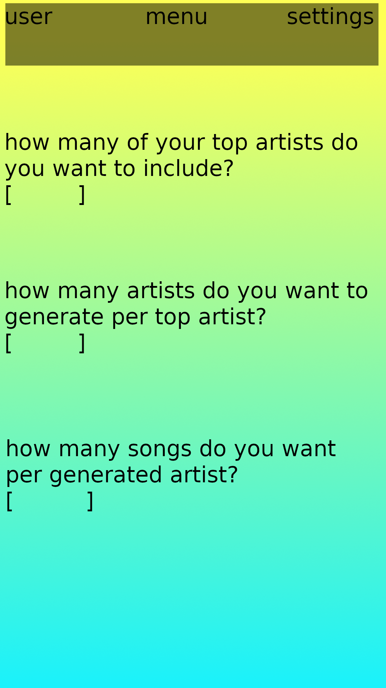

# Spot-It
A music discovery tool for spotify.

### Expected Behavior
Create a playlist on spotify with a specified amount of songs, from a specified amount of artists, related to a specified amount of artists.  

### References
* [Contribution](github/contrib.md)  
* [Code of Conduct](github/rules.md)  
* [Goals](github/GOALS.md)  
