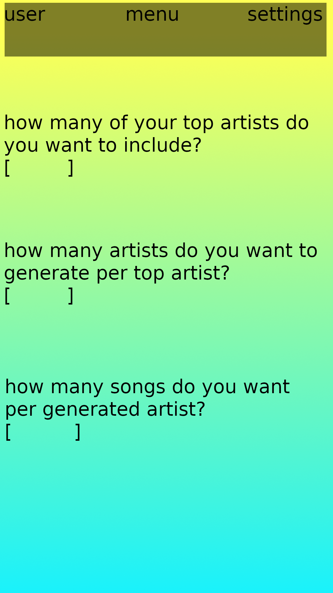

### Goals
For this project the goal is the rough guidelines to follow are:
* Creating a webapp or/and an android app
* Using React.js for the gui
* Using the Spotify Web-API for these functions:
  - Looking at top streamed artists of a user
  - Generating an amount of related artists based on these top streamed artists
  - Create a playlist with top songs of generated artists

tutorials and documentation:
* Spotify API: https://developer.spotify.com/documentation/web-api/  
* React.js: https://reactjs.org/  
* JavaScript: https://javascript.info/

### Mock Up's
A couple of mock up's have been made by the ui team:  

